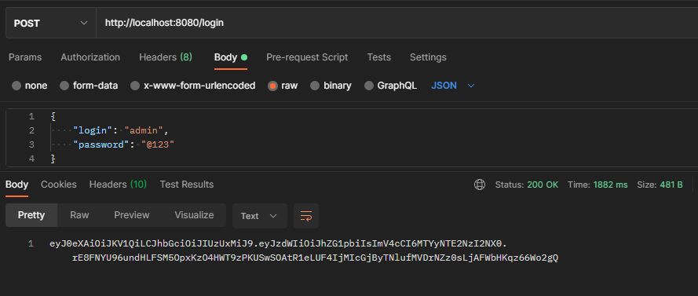
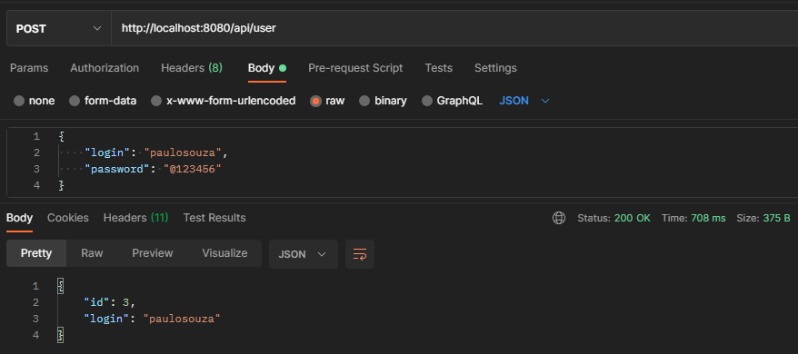
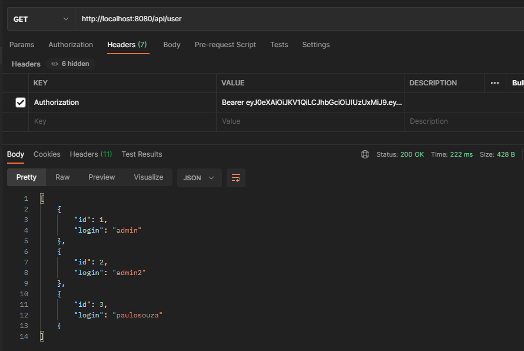
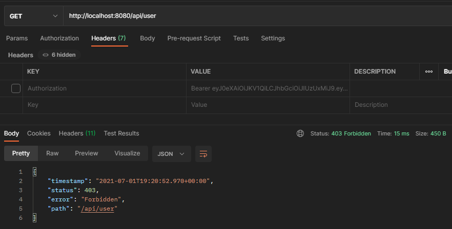
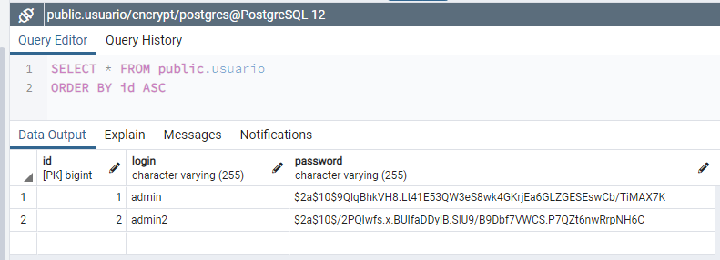

<h1 align="center">JWT Authentication</h1>

<p align="center">
  <a href="#about">About</a>&nbsp;&nbsp;&nbsp;|&nbsp;&nbsp;&nbsp;
  <a href="#preview">Preview</a>&nbsp;&nbsp;&nbsp;|&nbsp;&nbsp;&nbsp;
  <a href="#technologies">Technologies</a>&nbsp;&nbsp;&nbsp;|&nbsp;&nbsp;&nbsp;
  <a href="#building">Building</a>&nbsp;&nbsp;&nbsp;|&nbsp;&nbsp;&nbsp;
  <a href="#contributing">Contributing</a>&nbsp;&nbsp;&nbsp;
</p>


## About
A simple application using JWT and Spring Security for authenticate a user with login and password and then generate a JWT Token for acess all routes.


## Preview
```
POST: http://localhost:8080/login
```
<p align="center">
  
</p>

```
POST: http://localhost:8080/api/user
```
<p align="center">
  
</p>

```
GET: http://localhost:8080/api/user
```
<p align="center">
  
</p>

```
GET: http://localhost:8080/api/user
```
<p align="center">
  
</p>
<br/>

#### Database
<p align="center">
  
</p>


## Technologies
This project was developed using the following technologies:
- [Java](https://www.oracle.com/br/java/technologies/javase-jdk11-downloads.html)
- [JWT](https://jwt.io/)
- [Spring Boot](https://spring.io/projects/spring-boot)
- [Spring Security](https://spring.io/projects/spring-security)
- [Spring Data](https://spring.io/projects/spring-data)
- [Lombok](https://projectlombok.org/)
- [PostgreSQL](https://www.postgresql.org/)


## Building
You'll need [Java 11+](https://www.oracle.com/br/java/technologies/javase-jdk11-downloads.html) and [Maven](https://maven.apache.org/download.cgi) installed on your computer in order to build this app.

```bash
$ git clone https://github.com/eric-souzams/jwt-authentication.git
$ cd jwt-authentication
$ mvn spring-boot:run
```


## Contributing
This repository is currently under development. If you want to contribute please fork the repository and get your hands dirty, and make the changes as you'd like and submit the Pull request.